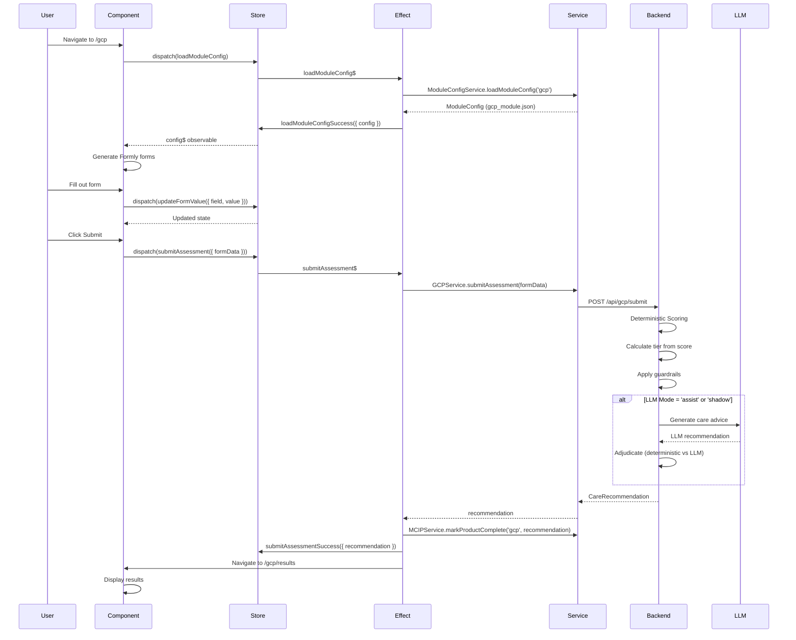

# GCP (Guided Care Plan) Architecture Guide

## Overview

The GCP module is a JSON-driven, AI-enhanced assessment system that recommends appropriate senior care levels based on cognitive, physical, and support needs. It combines deterministic scoring with optional LLM adjudication to provide accurate, explainable care recommendations.

**Key Technologies:**
- **Frontend:** Angular 20.3.9 (standalone components), NgRx (state management), Formly (dynamic forms), Material Design
- **Backend:** Node.js/Express, OpenAI GPT-4o-mini
- **Configuration:** JSON-based module definitions

---

## Directory Structure

```
senior_navigator_v4/
├── frontend/
│   └── src/
│       ├── app/
│       │   ├── core/
│       │   │   ├── guards/
│       │   │   │   └── product-access.guard.ts      # Route guards for prerequisites
│       │   │   └── services/
│       │   │       ├── mcip.service.ts               # Multi-product contract coordinator
│       │   │       ├── module-config.service.ts     # JSON → Formly converter
│       │   │       └── user-context.service.ts      # User session management
│       │   │
│       │   ├── features/
│       │   │   └── gcp/
│       │   │       ├── components/
│       │   │       │   ├── gcp-form/                # Main assessment form
│       │   │       │   │   ├── gcp-form.component.ts
│       │   │       │   │   ├── gcp-form.component.html
│       │   │       │   │   └── gcp-form.component.scss
│       │   │       │   └── gcp-results/             # Results display
│       │   │       │       ├── gcp-results.component.ts
│       │   │       │       ├── gcp-results.component.html
│       │   │       │       └── gcp-results.component.scss
│       │   │       │
│       │   │       ├── services/
│       │   │       │   └── gcp.service.ts           # API communication
│       │   │       │
│       │   │       ├── store/                        # NgRx state management
│       │   │       │   ├── gcp.actions.ts           # Action definitions
│       │   │       │   ├── gcp.reducer.ts           # State transitions
│       │   │       │   ├── gcp.selectors.ts         # Memoized selectors
│       │   │       │   └── gcp.effects.ts           # Side effects (API, navigation)
│       │   │       │
│       │   │       └── gcp.routes.ts                # Lazy-loaded routes
│       │   │
│       │   └── shared/
│       │       └── models/
│       │           └── contracts.ts                  # TypeScript interfaces
│       │
│       └── assets/
│           └── configs/
│               └── gcp_module.json                   # Question configuration
│
└── backend/
    ├── routes/
    │   └── gcp.js                                    # API endpoint handler
    └── services/
        ├── gcpScoring.js                             # Deterministic scoring engine
        ├── gcpNaviEngine.js                          # LLM adjudication
        ├── gcpTierMap.json                           # Cognition/Support routing
        ├── gcpFlagMetadata.json                      # Risk flag definitions
        └── llmClient.js                              # OpenAI integration
```

---

## Data Flow Architecture

### End-to-End Assessment Flow



---

## State Management (NgRx)

### State Shape

```typescript
interface GCPState {
  // Configuration
  config: ModuleConfig | null;        // Loaded JSON config
  configLoading: boolean;             // Loading indicator
  configError: string | null;         // Load error message
  
  // Form state
  formData: Record<string, any>;      // User's form responses
  currentSectionIndex: number;        // Which section is displayed
  
  // Submission
  submitting: boolean;                // Submission in progress
  submitError: string | null;         // Submission error
  recommendation: CareRecommendation | null;  // Final result
  
  // Completion
  completed: boolean;                 // Has user completed assessment?
}
```

### Action Flow

```
User Action → Component dispatches Action → Reducer updates State → Selectors provide derived data → Component renders

Side effects (API calls, navigation) handled by Effects
```

**Action Categories:**

1. **Configuration** - Load JSON config from assets
2. **Form Interaction** - Update values, navigate sections
3. **Submission** - Submit to backend, handle success/failure
4. **Reset** - Clear state for new assessment

### Key Selectors

| Selector | Purpose | Computation |
|----------|---------|-------------|
| `selectModuleConfig` | Get loaded config | Direct state access |
| `selectCurrentSection` | Current section object | Finds section by index |
| `selectProgress` | Progress percentage | `(current + 1) / total * 100` |
| `selectCanGoNext` | Can navigate forward? | `current < total - 1` |
| `selectCanGoPrevious` | Can navigate back? | `current > 0` |
| `selectIsLastSection` | On final section? | `current === total - 1` |
| `selectRecommendation` | Final result | Direct state access |

---

## Component Architecture

### GcpFormComponent (Smart Component)

**Responsibilities:**
- Load module configuration on init
- Render dynamic Formly forms from JSON
- Track section navigation
- Dispatch form value changes to store
- Handle submit action

**Key Features:**
- Reactive forms with Formly integration
- Section-based progression with stepper UI
- Real-time form validation
- Progress indicator
- Error handling with user feedback

**Template Structure:**
```html
<div class="form-container">
  <mat-card>
    <!-- Progress bar -->
    <mat-progress-bar [value]="progress$ | async" />
    
    <!-- Dynamic form (Formly) -->
    <formly-form [form]="form" [fields]="fields" [model]="model" />
    
    <!-- Navigation -->
    <button (click)="onPrevious()">Previous</button>
    <button (click)="onNext()">Next</button>
    <button (click)="onSubmit()">Submit</button>
  </mat-card>
</div>
```

### GcpResultsComponent (Presentation Component)

**Responsibilities:**
- Display care recommendation
- Show deterministic vs LLM comparison (when available)
- Present score breakdown
- Display risk flags
- Provide navigation to next steps

**Key Features:**
- Conditional rendering based on data availability
- Type-safe data transformations
- Material Design card layout
- Responsive grid system

---

## Service Layer

### GCPService (API Layer)

**Purpose:** Thin wrapper around HTTP calls to backend

```typescript
@Injectable({ providedIn: 'root' })
export class GCPService {
  submitAssessment(formData: Record<string, any>): Observable<CareRecommendation> {
    return this.http.post<CareRecommendation>(`${this.apiUrl}/submit`, formData);
  }
}
```

**Key Points:**
- Type-safe: Returns `Observable<CareRecommendation>`
- Environment-aware: Uses `environment.apiBaseUrl`
- Error propagation: Lets effects handle errors

---

### ModuleConfigService (Configuration Layer)

**Purpose:** Universal JSON → Formly translator for all products

**Key Methods:**

| Method | Purpose | Returns |
|--------|---------|---------|
| `loadModuleConfig(moduleId)` | Load JSON config via HTTP | `Observable<ModuleConfig>` |
| `convertToFormlyFields(config, context)` | Transform JSON to Formly fields | `FormlyFieldConfig[]` |
| `convertQuestionToFormlyField(question)` | Map single question | `FormlyFieldConfig` |
| `replacePlaceholders(text, context)` | Replace `{NAME}` tokens | `string` |

**Responsibilities:**
- Load configuration from `/assets/configs/{moduleId}_module.json`
- Transform questions into Material Design form fields
- Handle conditional visibility (`visible_if`)
- Map question types (string/number/boolean) to widgets (input/select/checkbox)
- Replace dynamic placeholders in labels and descriptions

**Example Transformation:**

```json
// JSON Config
{
  "id": "memory_concerns",
  "type": "string",
  "select": "single",
  "label": "Has {NAME} experienced memory changes?",
  "options": [
    { "value": "none", "label": "No changes" },
    { "value": "mild", "label": "Mild forgetfulness" }
  ]
}
```

```typescript
// Formly Field
{
  key: 'memory_concerns',
  type: 'radio',
  props: {
    label: 'Has John experienced memory changes?',
    required: false,
    options: [
      { value: 'none', label: 'No changes' },
      { value: 'mild', label: 'Mild forgetfulness' }
    ]
  }
}
```

---

### MCIPService (Multi-product Contract & Integration Protocol)

**Purpose:** Coordinate data handoff between products (GCP → Cost Planner → PFMA)

**Key Methods:**

| Method | Purpose | Storage |
|--------|---------|---------|
| `markProductComplete(productId, contract)` | Save product output | LocalStorage |
| `isProductComplete(productId)` | Check completion status | Boolean |
| `getCareRecommendation()` | Get GCP output | `CareRecommendation \| null` |
| `getFinancialProfile()` | Get Cost Planner output | `FinancialProfile \| null` |
| `getNextProduct()` | Determine next step | `string \| null` |

**State Management:**
```typescript
interface MCIPState {
  products: {
    gcp: ProductStatus;
    cost_planner: ProductStatus;
    pfma: ProductStatus;
  };
  current_product?: string;
  session_id: string;
}

interface ProductStatus {
  product_id: string;
  completed: boolean;
  completion_timestamp?: string;
  output_contract?: any;  // CareRecommendation | FinancialProfile | PFMAOutcome
}
```

---

## Backend Architecture

### Scoring Pipeline (gcpScoring.js)

**Purpose:** Calculate care recommendation using deterministic logic + optional LLM

**Main Function:**
```javascript
async function calculateRecommendation(formData, moduleConfig, llmMode) {
  // 1. Score based on JSON config
  const { totalScore, scoreByCategory, flagIds } = scoreModule(formData, moduleConfig);
  
  // 2. Apply guardrails
  const passesCognitiveGate = cognitiveGate(answers, flagIds);
  const allowedTiers = buildAllowedTiers(passesCognitiveGate);
  
  // 3. Determine tier from score + tier map
  const detTier = selectDeterministicTier({ tierFromScore, tierFromMapping, allowedTiers });
  
  // 4. Optional: Get LLM recommendation
  if (llmMode !== 'off') {
    const llmAdvice = await generateGCPAdvice(answers, scores, flags, allowedTiers);
    const adjudication = chooseFinalTier(detTier, allowedTiers, llmAdvice);
    finalTier = adjudication.tier;
  }
  
  // 5. Build CareRecommendation contract
  return {
    tier: finalTier,
    tier_score: totalScore,
    confidence: calculateConfidence(...),
    flags: flagObjects,
    rationale: buildRationale(...),
    adjudication: adjudicationDecision,
    llm_advice: llmAdvice,
    // ... more fields
  };
}
```

**Scoring Logic:**

1. **Iterate sections/questions** - Sum scores from selected options
2. **Category totals** - Group by cognition, ADL, safety, mobility
3. **Determine tier from score:**
   - 0-8: none
   - 9-16: in_home
   - 17-24: assisted_living
   - 25-39: memory_care
   - 40-100: memory_care_high_acuity

4. **Apply guardrails:**
   - **Cognitive Gate:** Requires diagnosed dementia + moderate/severe memory changes OR risky behaviors
   - **Behavior Gate:** Removes memory_care for moderate cognition + high support WITHOUT risky behaviors

5. **Tier Map Routing:** Use cognition band (none/mild/moderate/high) × support band (low/moderate/high/24h) matrix

6. **Select final tier:** Tier map takes precedence over score-based tier (if allowed)

---

### LLM Adjudication (gcpNaviEngine.js)

**Purpose:** Use GPT-4o-mini to provide context-aware recommendations with guardrails

**Policy Modes:**

| Mode | Behavior | Use Case |
|------|----------|----------|
| `off` | No LLM, deterministic only | Default production |
| `shadow` | LLM runs but doesn't affect output (logs only) | Testing, data collection |
| `assist` | LLM can override deterministic within allowed tiers | Enhanced accuracy |

**Guardrails:**

1. **Canonical Tier Enforcement:**
   - Only 5 allowed tiers: `none`, `in_home`, `assisted_living`, `memory_care`, `memory_care_high_acuity`
   - LLM cannot suggest "skilled nursing" or "independent living"

2. **Allowed Tier Filtering:**
   - LLM recommendation must be in `allowedTiers` set (from guardrails)
   - If not, falls back to deterministic

3. **Confidence Thresholds:**
   - LLM confidence < 0.7: Use deterministic
   - LLM confidence ≥ 0.7: Consider LLM override

**Adjudication Rules:**

```javascript
function chooseFinalTier(detTier, allowedTiers, llmTier, llmConfidence) {
  // Rule 1: LLM must be in allowed tiers
  if (!allowedTiers.has(llmTier)) {
    return { tier: detTier, source: 'deterministic', reason: 'llm_not_allowed' };
  }
  
  // Rule 2: Low confidence → use deterministic
  if (llmConfidence < 0.7) {
    return { tier: detTier, source: 'deterministic', reason: 'low_confidence' };
  }
  
  // Rule 3: Same tier → agree
  if (detTier === llmTier) {
    return { tier: detTier, source: 'agreement', reason: 'both_agree' };
  }
  
  // Rule 4: High confidence disagreement → use LLM (assist mode only)
  if (llmConfidence >= 0.8) {
    return { tier: llmTier, source: 'llm', reason: 'high_confidence_override' };
  }
  
  // Rule 5: Moderate confidence → use deterministic
  return { tier: detTier, source: 'deterministic', reason: 'moderate_confidence' };
}
```

---

## Configuration System

### JSON-Driven Forms

**Key Concept:** All form questions defined in `/frontend/src/assets/configs/gcp_module.json`

**Benefits:**
- ✅ No code changes to add/modify questions
- ✅ Product team can edit without developers
- ✅ A/B testing by swapping configs
- ✅ Version control in git
- ✅ Same config drives frontend AND backend scoring

**Module Structure:**
```json
{
  "module": {
    "id": "gcp_care_recommendation",
    "name": "Guided Care Plan",
    "version": "v2025.10",
    "display": { ... }
  },
  "sections": [
    {
      "id": "cognition",
      "title": "Memory & Thinking",
      "questions": [
        {
          "id": "memory_concerns",
          "type": "string",
          "select": "single",
          "label": "Has {NAME} experienced memory changes?",
          "required": true,
          "options": [
            { "value": "none", "label": "No changes", "score": 0 },
            { "value": "mild", "label": "Mild forgetfulness", "score": 2, "flags": ["cognitive_concern"] }
          ]
        }
      ]
    }
  ]
}
```

See **[CONFIGURATION_GUIDE.md](./CONFIGURATION_GUIDE.md)** for full reference.

---

## Type Safety & Contracts

### CareRecommendation Contract

```typescript
interface CareRecommendation {
  // Core recommendation
  tier: CareTier;                    // Final tier (deterministic or adjudicated)
  tier_score: number;                // Total assessment score
  confidence: number;                // 0.0-1.0
  
  // Supporting data
  tier_rankings: TierRanking[];      // All tiers with scores
  flags: CareFlag[];                 // Risk flags
  rationale: string[];               // Why this recommendation
  allowed_tiers: CareTier[];         // What tiers passed guardrails
  
  // Scoring breakdown
  score_breakdown: {
    cognition: number;
    adl: number;
    safety: number;
    mobility: number;
  };
  
  // LLM data (if enabled)
  adjudication?: AdjudicationDecision;  // How final tier was chosen
  llm_advice?: LLMAdvice;               // LLM recommendation details
  
  // Metadata
  assessment_id: string;
  timestamp: string;
  version: string;
  user_inputs: Record<string, any>;
  
  // Next steps
  next_step: {
    product: string;                 // 'cost_planner' or 'gcp' (if low confidence)
    label: string;
    description: string;
  };
  suggested_next_product: string;
}
```

**Contract Flow:**
```
GCP outputs CareRecommendation
    ↓
MCIP stores it
    ↓
Cost Planner reads it (to know care level for pricing)
    ↓
PFMA reads it (to determine eligibility)
```

---

## API Endpoints

### POST /api/gcp/submit

**Request:**
```json
{
  "age_range": "75-84",
  "living_situation": "alone",
  "memory_concerns": "moderate",
  "adl_challenges": ["bathing", "dressing"],
  "fall_risk": "multiple",
  // ... all form fields
}
```

**Response (Success 200):**
```json
{
  "tier": "assisted_living",
  "tier_score": 22.5,
  "confidence": 0.87,
  "flags": [
    {
      "id": "fall_risk_high",
      "label": "High Fall Risk",
      "tone": "warning"
    }
  ],
  "rationale": [
    "Based on 22 points, we recommend: Assisted Living",
    "Safety: 8 points",
    "• Multiple falls in past 6 months"
  ],
  "adjudication": {
    "det": "assisted_living",
    "llm": "assisted_living",
    "source": "agreement",
    "adjudication_reason": "both_agree"
  },
  "llm_advice": {
    "tier": "assisted_living",
    "confidence": 0.85,
    "reasons": [
      "Multiple falls indicate need for 24/7 monitoring",
      "ADL challenges require daily assistance"
    ],
    "navi_messages": [
      "Consider communities with emergency call systems"
    ]
  },
  // ... full CareRecommendation
}
```

**Response (Error 400/500):**
```json
{
  "error": "Missing form data",
  "message": "Request body must contain form responses"
}
```

---

## Environment Configuration

### Frontend (`environment.ts`)

```typescript
export const environment = {
  production: false,
  apiBaseUrl: 'http://localhost:3000/api',
  enableDebugLogs: true
};
```

### Backend (`.env`)

```bash
# Server
PORT=3000
NODE_ENV=development

# LLM Configuration
OPENAI_API_KEY=sk-...
OPENAI_MODEL=gpt-4o-mini
FEATURE_GCP_LLM_TIER=assist      # off | shadow | assist
DEBUG_LLM=on

# Feature Flags
FEATURE_GCP_MC_BEHAVIOR_GATE=on  # Enable behavior gate guardrail
```

---

## Performance Considerations

### Frontend Optimizations

- ✅ **Lazy Loading:** GCP route loaded on-demand
- ✅ **OnPush Change Detection:** Standalone components use OnPush by default
- ✅ **Memoized Selectors:** Prevents unnecessary recalculations
- ✅ **Subscription Management:** `takeUntil` pattern for cleanup
- ✅ **Small Bundle:** Material tree-shaking, minimal dependencies

### Backend Optimizations

- ⚠️ **LLM Latency:** GPT-4o-mini typically 1-3 seconds
- ⚠️ **Token Costs:** ~500-800 tokens per request ($0.001-0.002)
- 💡 **Future:** Consider caching similar assessments
- 💡 **Future:** Implement streaming for real-time feedback

---

## Security Considerations

### Frontend Security

- ✅ **No API Keys in Code:** All secrets in backend `.env`
- ✅ **Type Safety:** TypeScript prevents injection vulnerabilities
- ✅ **CORS Configured:** Backend restricts origins
- ⚠️ **Input Sanitization:** Form values passed directly (validated by Formly)

### Backend Security

- ✅ **Environment Variables:** API keys never committed
- ✅ **CORS Middleware:** Restricts cross-origin requests
- ⚠️ **Rate Limiting:** Not yet implemented
- ⚠️ **Input Validation:** Should add schema validation (e.g., Joi)

---

## Error Handling Strategy

### Frontend Error Handling

1. **Config Load Failure:**
   - Store: `configError` set
   - UI: Display error message with retry button

2. **Submission Failure:**
   - Store: `submitError` set
   - UI: Toast notification (MatSnackBar)
   - Effect: Logs to console (production: would send to Sentry)

3. **Network Errors:**
   - RxJS `catchError` in effects
   - User-friendly error messages
   - Preserves form data for retry

### Backend Error Handling

1. **Missing/Invalid Input:**
   - Return 400 Bad Request with details

2. **Config Load Failure:**
   - Return 500 Internal Server Error
   - Logs error details

3. **LLM API Failure:**
   - Falls back to deterministic
   - Logs warning
   - Continues with response

---

## Testing Strategy

### Unit Tests (To Be Implemented)

**Priority Order:**
1. Reducers (pure functions, easy to test)
2. Selectors (memoization verification)
3. Services (business logic)
4. Components (user interactions)

**Example Reducer Test:**
```typescript
describe('gcpReducer', () => {
  it('should update form value', () => {
    const initialState = { formData: {} };
    const action = GCPActions.updateFormValue({ field: 'age', value: 75 });
    const state = gcpReducer(initialState, action);
    
    expect(state.formData).toEqual({ age: 75 });
  });
});
```

### Integration Tests (To Be Implemented)

- Test complete assessment flow
- Test MCIP contract handoff
- Test error scenarios

### E2E Tests (To Be Implemented)

```typescript
test('Complete GCP assessment', async ({ page }) => {
  await page.goto('/gcp');
  await page.fill('[name="age_range"]', '75-84');
  await page.click('text=Next');
  // ... fill form
  await page.click('text=Submit');
  await expect(page).toHaveURL('/gcp/results');
  await expect(page.locator('h2')).toContainText('Assisted Living');
});
```

---

## Troubleshooting Guide

### Common Issues

**Issue:** Config not loading
```
Error: Failed to load module configuration
```
**Solution:** Check that `gcp_module.json` exists in `/frontend/src/assets/configs/`

---

**Issue:** Backend 500 error on submit
```
Error: Could not load module configuration
```
**Solution:** Backend reads from `../../frontend/src/assets/configs/gcp_module.json` - ensure path is correct

---

**Issue:** LLM not running (deterministic only)
```
[GCP Scoring] LLM mode: off
```
**Solution:** Set `FEATURE_GCP_LLM_TIER=assist` in backend `.env`

---

**Issue:** Form not displaying
```
No sections rendered
```
**Solution:** Check browser console for config loading errors, ensure `loadModuleConfig` action dispatched

---

## Next Steps

1. **Read [DETERMINISTIC_VS_LLM.md](./DETERMINISTIC_VS_LLM.md)** - Understand scoring logic
2. **Read [CONFIGURATION_GUIDE.md](./CONFIGURATION_GUIDE.md)** - Learn to modify questions
3. **Review [contracts.ts](../frontend/src/app/shared/models/contracts.ts)** - Understand data structures
4. **Explore [gcp_module.json](../frontend/src/assets/configs/gcp_module.json)** - See full configuration

---

## Additional Resources

- [Angular NgRx Documentation](https://ngrx.io)
- [Formly Documentation](https://formly.dev)
- [Material Design Components](https://material.angular.io)
- [OpenAI API Reference](https://platform.openai.com/docs)

---

**Last Updated:** November 9, 2025  
**Version:** 1.0  
**Authors:** Senior Navigator Engineering Team
